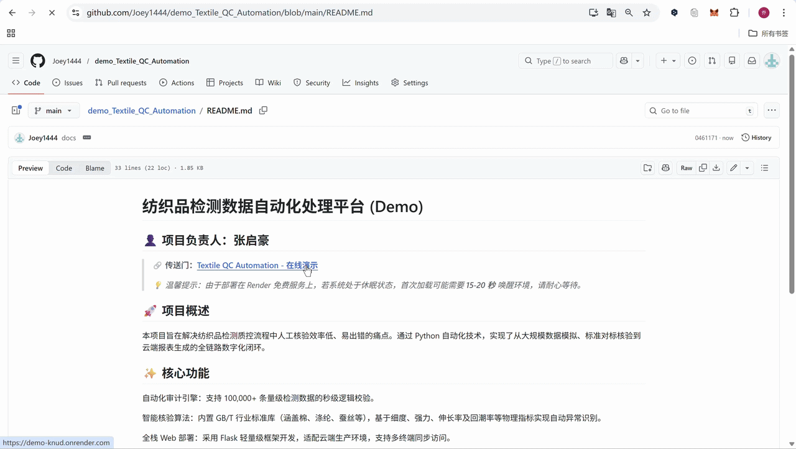

# 纺织品检测数据自动化处理平台 (Demo)
## 👤 项目负责人：张启豪
> **🔗 平台传送门：[Textile QC Automation - 在线演示](https://demo-knud.onrender.com)**
> 
> *💡 温馨提示：由于部署在 Render 免费服务上，若系统处于休眠状态，首次加载可能需要 **15-20 秒** 唤醒环境，请耐心等待。*

## 🚀 1项目概述
本项目旨在解决纺织品检测质控流程中人工核验效率低、易出错的痛点。通过 Python 自动化技术，实现了从大规模数据模拟、标准对标核验到云端报表生成的全链路数字化闭环。

## ✨ 2核心功能
自动化审计引擎：支持 100,000+ 条量级检测数据的秒级逻辑校验。

智能核验算法：内置 GB/T 行业标准库（涵盖棉、涤纶、蚕丝等），基于细度、强力、伸长率及回潮率等物理指标实现自动异常识别。

全栈 Web 部署：采用 Flask 轻量级框架开发，适配云端生产环境，支持多终端同步访问。

一键质控报告：集成数据导出模块，支持实时生成符合行业规范的 Excel 审计报告。

## 📂 3演示数据

本项目内置了一个基于 **Faker** 与 **NumPy** 构建的合成数据引擎，模拟生成的 **3,000 条**（支持扩展至 100,000+ 条）原始检测记录：

| 字段名 (Field) | 内容 | 物理意义 |
| :--- | :--- | :--- |
| **Fiber** | 纤维种类 | 棉 (Cotton) / 涤纶 (Polyester) / 蚕丝 (Silk) |
| **Dtex** | 纤维细度 (分特) | 衡量单位质量内纤维的粗细程度 |
| **Strength** | 断裂强力 (cN) | 评估纤维耐拉伸物理强度的关键指标 |
| **Elongation** | 断裂伸长率 (%) | 衡量纤维在拉断瞬间的弹性形变能力 |

您可以将该演示数据"input_data"下载到本地，通过在线平台运行：[🔗 点击进入在线平台](https://demo-knud.onrender.com)

## 📺 4功能演示 (Demo Video)
> **💡 操作提示**：下方为在线平台运行的实时演示（GIF 自动加载）。
> 

© 张启豪 - 作品集
